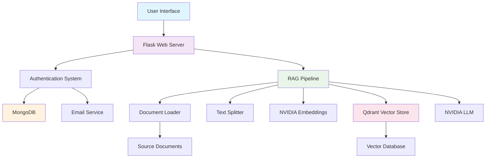

# 🎓 CSM Query System

<div align="center">


**Experience Data at Fingertips** 📊

*An AI-powered query system designed exclusively for CSM students to access instant insights and answers about academic information.*

[🚀 Live Demo](https://your-demo-link.com) • [📖 Documentation](https://github.com/Epik-Whale463/College_Query_System/wiki) • [🐛 Report Bug](https://github.com/Epik-Whale463/College_Query_System/issues)

</div>

---

## 📋 Table of Contents

- [✨ Features](#-features)
- [🏛️ Architecture](#️-architecture)
- [🛠️ Installation](#️-installation)
- [⚙️ Configuration](#️-configuration)
- [🚀 Usage](#-usage)
- [📁 Project Structure](#-project-structure)
- [🔧 API Endpoints](#-api-endpoints)
- [🎨 UI/UX](#-uiux)
- [🧪 Testing](#-testing)
- [🤝 Contributing](#-contributing)
- [📜 License](#-license)
- [👨‍💻 Author](#-author)

## ✨ Features

### 🤖 **AI-Powered Query Processing**
- **NVIDIA NIM Integration**: Leverages cutting-edge NVIDIA AI models for natural language understanding
- **RAG Architecture**: Retrieval-Augmented Generation for accurate, context-aware responses
- **Smart Document Processing**: Automatic parsing and indexing of academic documents

### 🎓 **Academic Information Access**
- **📚 Current Syllabus**: Instant access to CSE 3-2 semester curriculum
- **👨‍🏫 Faculty Information**: Faculty schedules and timetable details
- **📅 Academic Calendar**: Semester dates and important deadlines
- **📊 Student Data**: Marks, performance analytics, and student details
- **🎯 Project Information**: 3-2 project guidelines, timelines, and requirements

### 🔐 **Security & Authentication**
- **Email-Based Registration**: Secure signup with OTP verification
- **College Email Restriction**: Limited to @vvit.net domain for exclusivity
- **Session Management**: Secure user sessions with MongoDB storage
- **Query Limits**: Fair usage policy with daily query restrictions

### 🎨 **Modern UI/UX**
- **Responsive Design**: Optimized for desktop, tablet, and mobile devices
- **Dark/Light Mode**: Seamless theme switching with user preference persistence
- **Glassmorphism UI**: Modern, elegant interface with backdrop blur effects
- **Real-time Feedback**: Loading states, progress indicators, and toast notifications
- **Markdown Support**: Rich text rendering for formatted responses

### 📊 **Advanced Features**
- **Vector Search**: Qdrant-powered semantic search for document retrieval
- **Chat History**: Track and review previous queries
- **Error Handling**: Comprehensive error management with user-friendly messages
- **Performance Monitoring**: Query count tracking and usage analytics

## 🏛️ Architecture



### **Technology Stack**

#### **Backend**
- **🐍 Python 3.8+**: Core programming language
- **🌶️ Flask**: Lightweight web framework
- **🗄️ MongoDB**: NoSQL database for user management
- **🔍 Qdrant**: Vector database for semantic search
- **📧 SMTP**: Email service for notifications

#### **AI/ML Components**
- **🚀 NVIDIA NIM**: AI model serving platform
- **🦜 LangChain**: LLM application framework
- **📄 LlamaIndex**: Document indexing and retrieval
- **🔢 Vector Embeddings**: Semantic text representation

#### **Frontend**
- **📱 HTML5/CSS3**: Modern web standards
- **⚡ JavaScript**: Interactive functionality
- **🎨 Custom CSS**: Responsive design system
- **📝 Markdown**: Rich text rendering

## 🛠️ Installation

### **Prerequisites**
- Python 3.8 or higher
- MongoDB instance
- NVIDIA API access
- Qdrant Cloud account (or local instance)
- SMTP email service

### **1. Clone Repository**
```bash
git clone https://github.com/Epik-Whale463/College_Query_System.git
cd College_Query_System
```

### **2. Create Virtual Environment**
```bash
python -m venv venv

# On Windows
venv\Scripts\activate

# On macOS/Linux
source venv/bin/activate
```

### **3. Install Dependencies**
```bash
pip install -r requirements.txt
```

### **4. Environment Configuration**
Create a `.env` file in the root directory:

```env
# MongoDB Configuration
MONGODB_URI=mongodb://localhost:27017/
MONGODB_DATABASE=csm_query_system

# NVIDIA API
NVIDIA_API_KEY=your_nvidia_api_key_here

# Qdrant Configuration
QDRANT_URL=https://your-qdrant-cluster.qdrant.io:6333
QDRANT_API_KEY=your_qdrant_api_key_here

# Email Configuration
SMTP_SERVER=smtp.gmail.com
SMTP_PORT=587
SMTP_EMAIL=your_email@gmail.com
SMTP_PASSWORD=your_app_password

# Flask Configuration
FLASK_SECRET_KEY=your_secret_key_here
FLASK_ENV=development
```

### **5. Initialize Database**
```bash
python -c "from app import initialize_rag; initialize_rag()"
```

### **6. Run Application**
```bash
python app.py
```

The application will be available at `http://localhost:5000`

## ⚙️ Configuration

### **Document Sources**
Place your academic documents in the `source_documents/` directory:
- `about_vvit.txt` - College information
- `cur_syllabus.txt` - Current syllabus
- `faculty_schedule.txt` - Faculty timetables
- `project_details.txt` - Project information
- `semester_calender.txt` - Academic calendar
- `student_marks.txt` - Student performance data
- `students_details.txt` - Student information

### **Customization**
- **Query Limits**: Modify `MAX_QUERIES_PER_DAY` in `app.py`
- **UI Theme**: Customize CSS variables in `static/style.css`
- **Email Templates**: Edit templates in `python_modules/generate_send_mail.py`

## 🚀 Usage

### **User Registration**
1. Visit the registration page
2. Enter your college email (@vvit.net)
3. Verify your email with the OTP sent
4. Complete registration process

### **Querying the System**
1. **Login** to your account
2. **Type your question** in natural language
3. **Get instant AI-powered responses** with relevant information
4. **Use demo topics** for quick queries

### **Example Queries**
- "What is the syllabus for Machine Learning?"
- "When is the next semester exam?"
- "Show me faculty schedule for CSE department"
- "What are the project submission deadlines?"

## 📁 Project Structure

```
College_Query_System/
├── 📁 source_documents/        # Academic documents
│   ├── about_vvit.txt
│   ├── cur_syllabus.txt
│   ├── faculty_schedule.txt
│   ├── project_details.txt
│   ├── semester_calender.txt
│   ├── student_marks.txt
│   └── students_details.txt
├── 📁 python_modules/          # Core Python modules
│   ├── add_user.py            # User management
│   ├── generate_send_mail.py   # Email services
│   ├── rag_functions.py       # RAG pipeline
│   └── users.txt             # User data
├── 📁 static/                 # Static assets
│   ├── style.css             # Main stylesheet
│   └── favicon.ico           # Site icon
├── 📁 templates/              # HTML templates
│   ├── home.html             # Landing page
│   ├── index.html            # Main query interface
│   ├── login.html            # Login page
│   ├── register.html         # Registration page
│   ├── verify_otp.html       # OTP verification
│   ├── 404.html              # Error pages
│   └── 500.html
├── 📄 app.py                  # Main Flask application
├── 📄 requirements.txt        # Python dependencies
├── 📄 Dockerfile             # Docker configuration
├── 📄 .gitignore             # Git ignore rules
└── 📄 README.md              # This file
```

## 🔧 API Endpoints

| Endpoint | Method | Description | Authentication |
|----------|--------|-------------|----------------|
| `/` | GET | Home page | ❌ |
| `/register` | GET/POST | User registration | ❌ |
| `/verify-otp` | GET/POST | OTP verification | ❌ |
| `/login` | GET/POST | User login | ❌ |
| `/logout` | GET | User logout | ✅ |
| `/dashboard` | GET | Main query interface | ✅ |
| `/query` | POST | Process user queries | ✅ |
| `/query-count` | GET | Get user query statistics | ✅ |

## 🎨 UI/UX

### **Design System**
- **🎨 Color Palette**: Modern blue gradient theme
- **📱 Responsive Design**: Mobile-first approach
- **✨ Animations**: Smooth transitions and micro-interactions
- **🌓 Theme Support**: Dark and light mode toggle
- **♿ Accessibility**: WCAG compliant design

### **Key Components**
- **Glassmorphism Cards**: Modern translucent design
- **Interactive Elements**: Hover effects and feedback
- **Loading States**: Progress indicators and spinners
- **Toast Notifications**: User feedback system
- **Markdown Rendering**: Rich text support

## 🧪 Testing

### **Manual Testing**
```bash
# Test user registration
curl -X POST http://localhost:5000/register \
  -H "Content-Type: application/json" \
  -d '{"email":"test@vvit.net","password":"password123"}'

# Test query endpoint
curl -X POST http://localhost:5000/query \
  -H "Content-Type: application/json" \
  -d '{"query":"What is the current syllabus?"}'
```

### **Load Testing**
- Test query processing performance
- Verify concurrent user handling
- Monitor database response times

## 🤝 Contributing

We welcome contributions to improve the CSM Query System! Here's how you can help:

### **Development Setup**
1. Fork the repository
2. Create a feature branch (`git checkout -b feature/amazing-feature`)
3. Make your changes
4. Commit your changes (`git commit -m 'Add amazing feature'`)
5. Push to the branch (`git push origin feature/amazing-feature`)
6. Open a Pull Request

### **Contribution Guidelines**
- Follow Python PEP 8 style guidelines
- Add comments for complex functionality
- Update documentation for new features
- Test your changes thoroughly

### **Issues**
- 🐛 **Bug Reports**: Use the bug report template
- 💡 **Feature Requests**: Describe the proposed functionality
- 📖 **Documentation**: Help improve our docs

## 📜 License

This project is licensed under the MIT License - see the [LICENSE](LICENSE) file for details.

## 👨‍💻 Author

**Rama Charan**
- 🎓 **Affiliation**: CSM Department, VVIT
- 📧 **Email**: [your-email@vvit.net](mailto:your-email@vvit.net)
- 🔗 **GitHub**: [@Epik-Whale463](https://github.com/Epik-Whale463)

---

<div align="center">

### 🌟 **Show your support**

Give a ⭐️ if this project helped you!

**Made with ❤️ for CSM Students**


</div>

---

## 📊 **Project Statistics**

- **🚀 Status**: Active Development
- **📅 Created**: January 2025
- **🔄 Last Updated**: June 2025
- **👥 Contributors**: 1
- **🌟 Stars**: Be the first!
- **🍴 Forks**: 0

## 🔮 **Future Enhancements**

- [ ] **Multi-language Support**: Add regional language support
- [ ] **Voice Queries**: Voice-to-text query input
- [ ] **Advanced Analytics**: Detailed usage analytics dashboard
- [ ] **Mobile App**: Native mobile application
- [ ] **API Integration**: RESTful API for third-party integration
- [ ] **Real-time Chat**: Live chat support system
- [ ] **Document Upload**: User document upload functionality
- [ ] **Export Features**: Export responses to PDF/Word

---

*This README was last updated on June 19, 2025*
